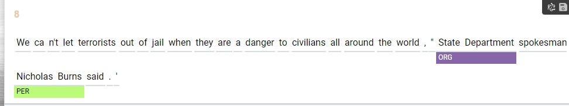
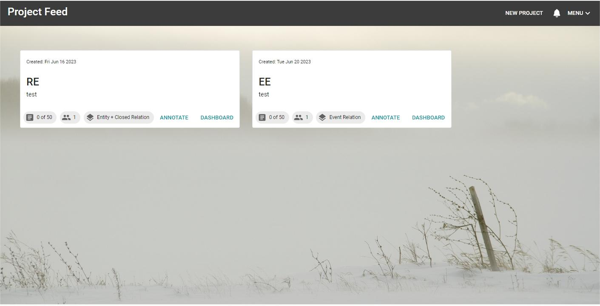
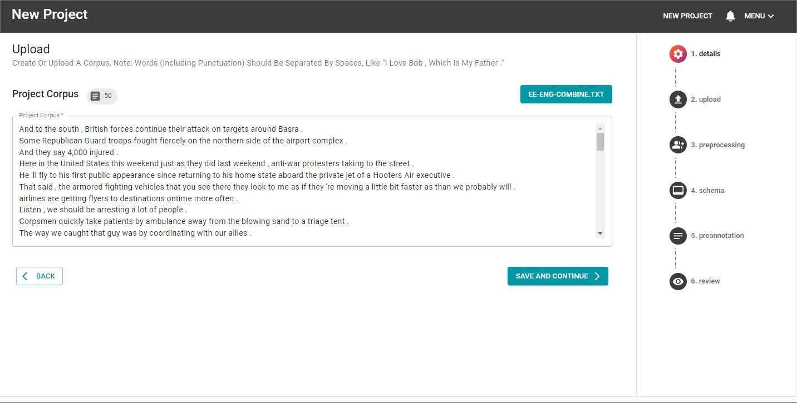
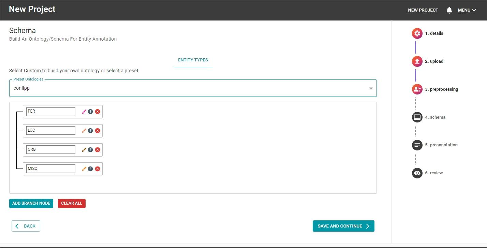
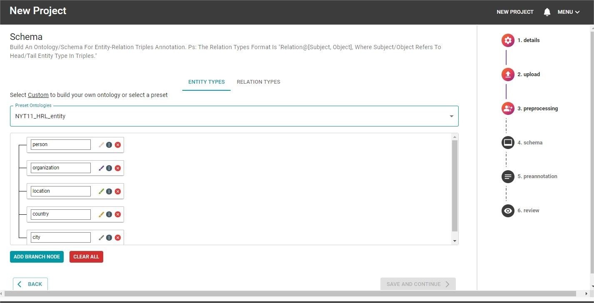
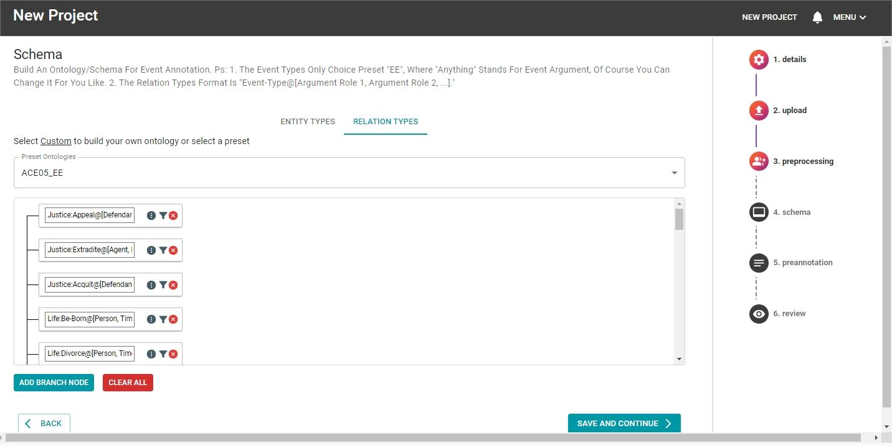
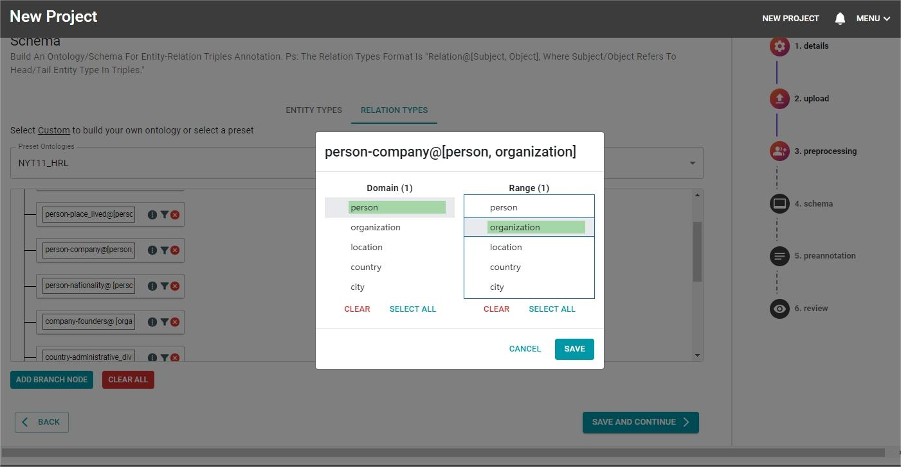

# About CollabKG
- [About CollabKG](#about-collabkg)
  - [Annotation](#annotation)
    - [NER](#ner)
      - [auto](#auto)
      - [manual](#manual)
    - [RE](#re)
      - [auto](#auto-1)
      - [manual](#manual-1)
    - [EE](#ee)
      - [auto](#auto-2)
      - [manual](#manual-2)
    - [model update (Learnability)](#model-update-learnability)
    - [propagation](#propagation)
      - [enitity](#enitity)
      - [relation/event](#relationevent)
  - [Cluster](#cluster)
  - [Project Feed](#project-feed)
  - [Project Creation](#project-creation)
    - [Details](#details)
    - [Corpus Upload](#corpus-upload)
    - [Corpus Preprocessing](#corpus-preprocessing)
    - [Project Ontology/Schema](#project-ontologyschema)
      - [NER](#ner-1)
      - [RE](#re-1)
      - [EE](#ee-1)
      - [Relation Constraints](#relation-constraints)
    - [Corpus Pre-annotation](#corpus-pre-annotation)
      - [Entity Preannotation](#entity-preannotation)
      - [Typed Triple Preannotation](#typed-triple-preannotation)
    - [Project Review and Creation](#project-review-and-creation)
  - [Project Dashboard](#project-dashboard)


CollabKG: A Learnable Human-Machine-Cooperative Information Extraction Toolkit for (Event) Knowledge Graph Construction.

- CollabKG is an open-source IE annotation toolkit that **unifies NER, RE, and EE tasks**, integrates **KG and EKG**, and supports both English and Chinese languages. 
- CollabKG **combines automatic and manual labeling** to build a human-machine cooperative system. In particular, humans benefit from machines and meanwhile, manual labeling provides a reference for machines to update during annotation. 
- Additionally, CollabKG is designed with many other **appealing features** (customization, training-free, propagation, etc) that enhance productivity, power, and user-friendliness. We holistically compare our toolkit with other existing tools on these features.
- CollabKG **Extensive human studies** suggest that CollabKG can significantly improve the effectiveness and efficiency of manual annotation, as well as reduce variance.


## Annotation

### NER
#### auto




#### manual


### RE
#### auto


#### manual


### EE
#### auto


#### manual


### model update (Learnability)


1. The first time you click the automatic annotation of the second sentence, it will not recognize *(Apple, ORG)*.

2. When you label the first sentence with *(Apple, ORG)* and click the Auto Label button, the model will be updated.

3. When you click the auto-label button of the second sentence again, it will recognize *(Apple, ORG)* (because the prefix prompt `Note:Apple is ORG ...;` will remind the model, and make it successfully recognize it.)

### propagation
#### enitity


#### relation/event


## Cluster


Aggregate documents/sentences into clusters by embedding with SBERT sentence embedding.

## Project Feed



This page (above) shows all the projects you have created (and manage) as well as projects you are a part of. Each card in the feed shows the projects - creation date, name, description, number of documents annotated by the group (or yourself if single user annotation), number of active annotators, and task configuration.

## Project Creation

Clicking on `new project` will take you to CollabKG's project creation page.

### Details


The details page is where the projects `name`, `description`, `task type`, `model update` and `clustering` options are specified. Each project is distinguished by its name and description. Currently, CollabKG the following tasks:

- **Entity** annotation
- **Event** annotation
- **Entity and relation triple** annotation

Model Update: manual labeling provides a reference for machines to update during annotation.

Clustering: allows projects to have their sentences/documents clustered by embedding sentences/documents and clustering them using agglomerative clustering via Sentence-BERT.

### Corpus Upload



Uploading a corpus (English/Chinese) to the new project is possible by either loading a text file or pasting in a set of new line separated texts. After either action, the number of texts in the corpus will be presented.
Note: Words (Including Punctuation) Should Be Separated By Spaces, Like "I Love Bob , Which Is My Father ."

### Corpus Preprocessing


To improve annotation efficiency, CollabKG allows uploaded corpora to be lightly preprocessed. The preprocessing actions include:

- Removing casing,
- Removing characters, and
- Removing duplicate texts

If any of these actions are selected, the impacts on the corpus will be shown via:

- Corpus size reduction,
- Vocabulary size reduction, and
- Overall number of token removed

The preprocessing steps are irreversible and will be displayed on the projects dashboard. 

### Project Ontology/Schema
Depending on the multi-task configuration selected at the details step, an ontology/schema must be specified for entities, relations or events.

#### NER



A custom entity ontology can be built consiting of an arbitrary number of classes. Alternatively, preset entity ontologies also exist. Warning: Selecting any of these will override any custom ontology created.

#### RE


Format: *relation@[subject_type, object_type]* like *person-place_lived@[person, location]*

A custom relation ontology can be built consiting of an arbitrary number of classes. Alternatively, preset relation ontologies also exist. Warning: Selecting any of these will override any custom ontology created.

Note corresponding entity:



#### EE



Format: *event_type@[argument_role_1, argument_role_2, ...]* like *Life:Be-Born@[Person, Time, Place]*

A custom event ontology can be built consiting of an arbitrary number of classes. Alternatively, preset event ontologies also exist. Warning: Selecting any of these will override any custom ontology created.

Note fixed `entityOntologies` for all event extaction, *Anything* denotes the type for all *Arguments*:


#### Relation Constraints



Only for RE:

A feature of CollabKG is the ability to apply relation constraints onto relations in the relation ontology by pressing button. This feature allows the domain and range of relations to be specified by selecting entities from the entity ontology. For example, show above is the domain and range specified for the relation `person-company` - here, the domain is `person` and `organization` is the range. By specifying this, annotators will only be able to apply `person-company` relation from `person` to `organization`, namely `(person, person-company, organization)`. For large relation ontologies, this enhances the speed of relation annotation by reducing time and cognitive load searching for applicable relations between entities.

### Corpus Pre-annotation


To aid annotation, CollabKG allows projects to be preannotated using predefined resources. Currently, CollabKG allows *entity preannotation* and *typed triple preannotation*.

#### Entity Preannotation

Entity preannotation requires the resource to be formatted as a text file consisting of lines with `token span,entity class`. For example:

```
Bob,person 
```

When the project is created, the specified tokens will have the entity classes applied as `suggestions` that the annotator must accept.

#### Typed Triple Preannotation

Typed triple preannotation requires the resource to be formatted as a text file consisting of lines with `source span, source type, relation type, target span, target type, offset`. Here the often is the number of tokens separating the source and target. This is implemented to reduce the over application of triples. An example resource looks like:

```
Bob,person,person-company,Google,organization,2
```

This would match on the sentence `Bob worked for Google` where `worked for` consists of 2 tokens that offset the source and target spans.

### Project Review and Creation


At the end of the project creation process, an overview of the steps performed is presented. At any stage, the step can be modified by clicking the `back` button. If the project is created satisfactorily, clicking `create` will create the project. Note that for large projects (thousands of documents) or projects with clustering, this process may take a few minutes. 


## Project Dashboard

Our toolkit offers a range of features to enhance the user-friendly display.

Firstly, it displays annotation progress and counts the results across multiple dimensions, such as entity, relation, and triples.


Secondly, users can view a Knowledge Graph or Entity Knowledge Graph (EKG) and filter the results.


Thirdly, the tool provides a double-checking function for each text/document.


Finally, our tool supports the filtering and exporting functions. Filter function includes saving, loading, quality filtering (accepted or suggested), and so on.

